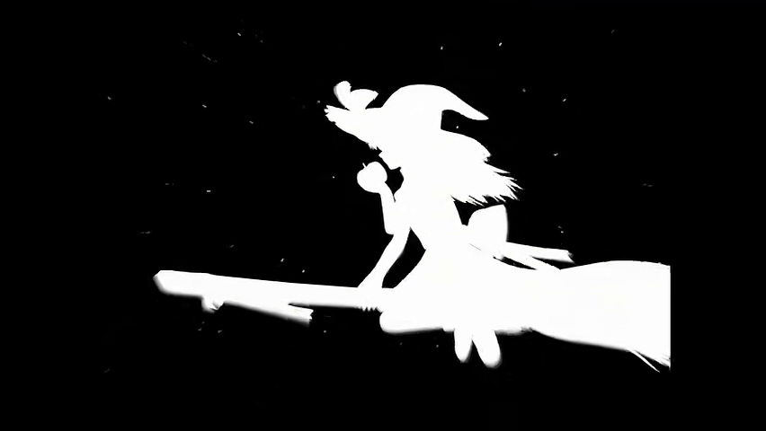
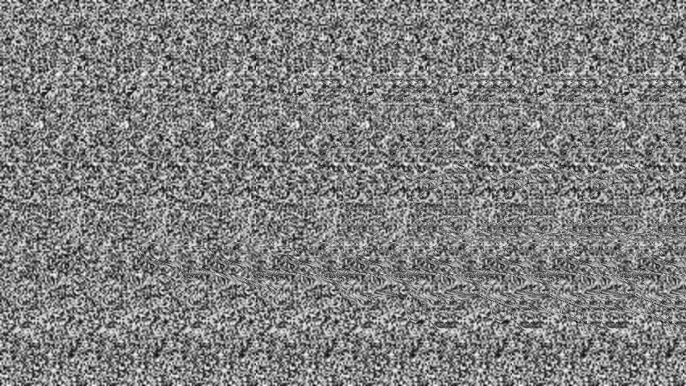
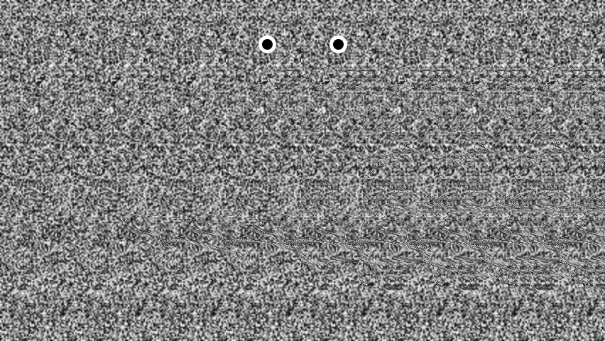

# 生成自动立体图和视频
原图

自动立体图

自动立体图（附有焦点）

### 使用方法
1. 安装ffmpeg
2. 安装numpy和opencv-python
```
pip install numpy opencv-python
```

克隆项目
```
git clone https://github.com/Matoi647/autostereogram.git
```

制作自动立体图需要使用深度图，如果没有深度图，可以使用`asg.binarize_video()`将图像二值化作为替代
```python
    import autostereogram as asg

    asg.asg_img(r"YOUR_IMAGE_PATH", r"OUTPUT_PATH")
    # asg.binarize_video(r"YOUR_VIDEO_PATH", r"OUTPUT_PATH")
    # asg.asg_video(r"YOUR_VIDEO_PATH", r"OUTPUT_PATH")
```
